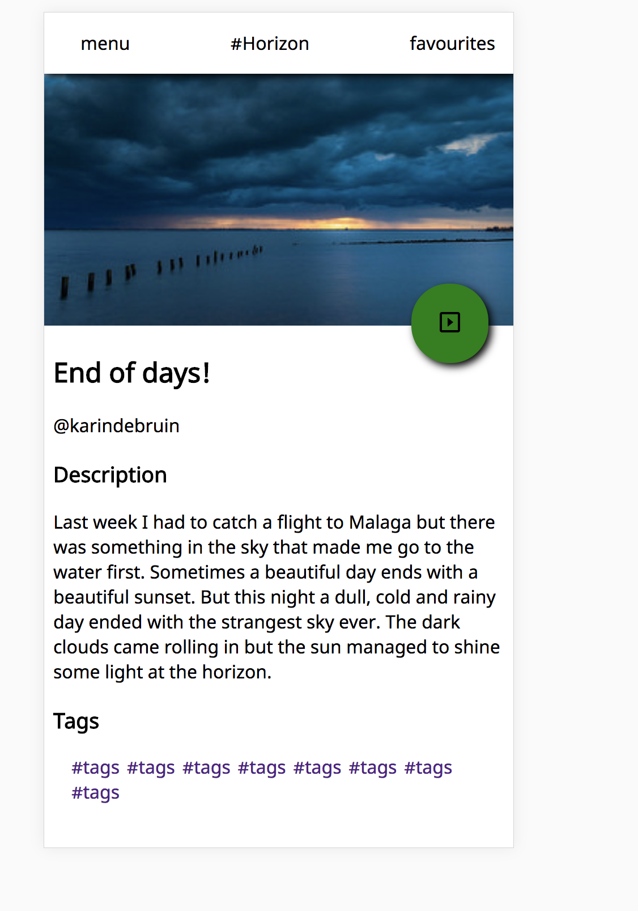
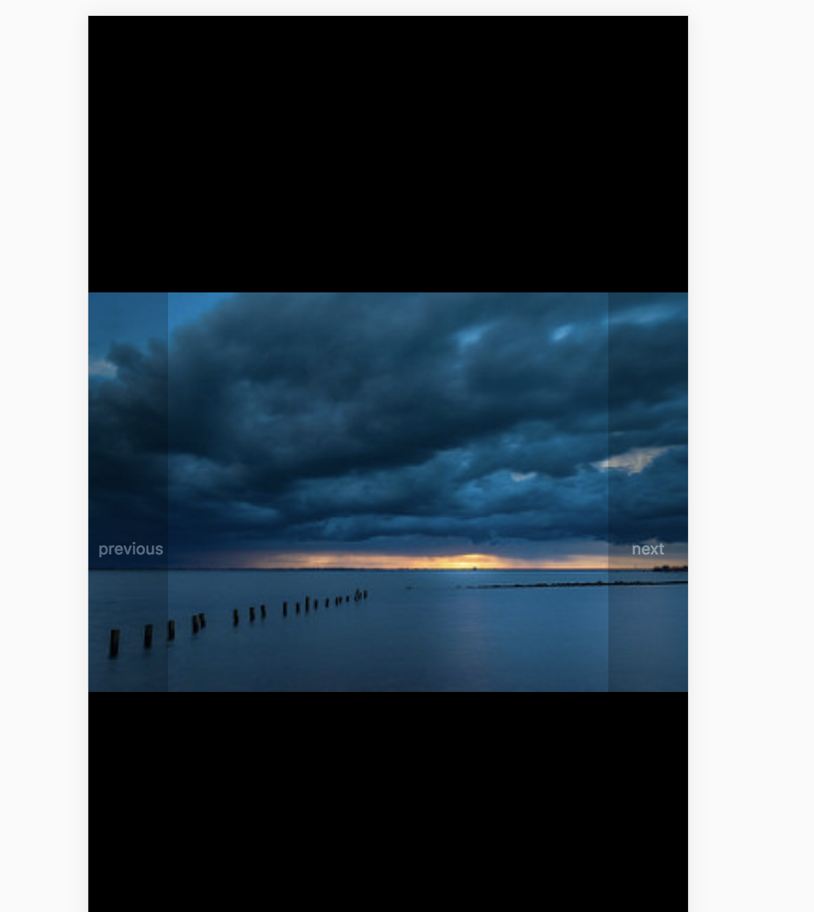

# Photo App

A small little photo app that has a overview and a slideshow.

## Principals

### Provide a natural next step
In my website appear as such by making it stand uit of the rest and making buttons look like real buttons, for example.

### Strong visual hierarchies work best
There is some visual hierachy going on as the picutures take main stage. Less headers and more pictures!

### One primary action per screen
There is always one interaction per screen. The interaction is on overview and you can choose if you want to use it.

## Made with
* Html
* CSS
